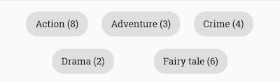
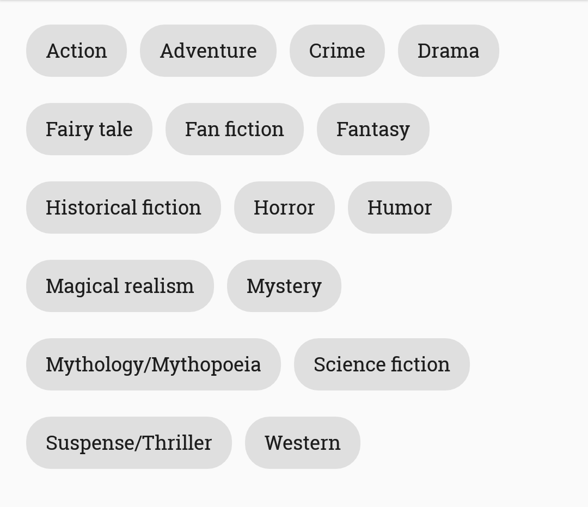
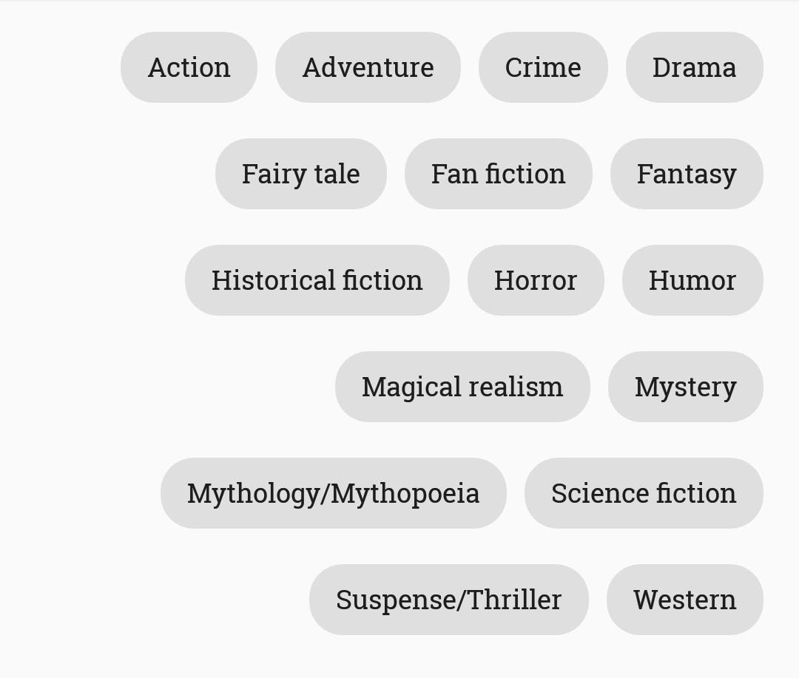
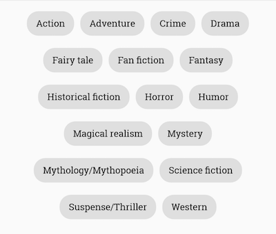
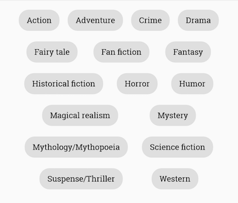

# ChipCloud
[](https://jitpack.io/#fiskurgit/ChipCloud) [](https://travis-ci.org/fiskurgit/ChipCloud) [](https://github.com/fiskurgit/ChipCloud/blob/master/LICENSE) [](https://www.codacy.com/app/fiskur/ChipCloud?utm_source=github.com&amp;utm_medium=referral&amp;utm_content=fiskurgit/ChipCloud&amp;utm_campaign=Badge_Grade) [](https://gitter.im/fiskurgit/fiskur) 
<a href="http://www.methodscount.com/?lib=com.github.fiskurgit%3AChipCloud%3A2.1.0"></a>

##Note - complete rewrite coming soon. Please don't submit any pull requests as the entire current codebase will soon be redundant.

ChipCloud is an Android view (very) quickly knocked up for a larger hackathon project, it creates a wrapping cloud of '[Chips](https://www.google.com/design/spec/components/chips.html)'. Basic demo is [available on the Play Store](https://play.google.com/store/apps/details?id=eu.fiskur.chipclouddemo) - the code is badly written and while I'm happy people are using it please bear in mind I have little time to maintain and refactor the source.


## Usage

Add to your Android layout xml:
```xml
<eu.fiskur.chipcloud.ChipCloud
    android:id="@+id/chip_cloud"
    android:layout_width="match_parent"
    android:layout_height="wrap_content"/>
```

Configure in xml:  
```xml
<eu.fiskur.chipcloud.ChipCloud
    xmlns:chipcloud="http://schemas.android.com/apk/res-auto"
    android:id="@+id/chip_cloud"
    android:layout_width="match_parent"
    android:layout_height="wrap_content"
    chipcloud:deselectedColor="@color/deselected_color"
    chipcloud:deselectedFontColor="@color/deselected_font_color"
    chipcloud:selectedColor="@color/selected_color"
    chipcloud:selectedFontColor="@color/selected_font_color"
    chipcloud:deselectTransitionMS="500"
    chipcloud:selectTransitionMS="750"
    chipcloud:labels="@array/labels"
    chipcloud:selectMode="required"
    chipcloud:allCaps="true"
    chipcloud:gravity="staggered"
    chipcloud:minHorizontalSpacing="32dp"
    chipcloud:verticalSpacing="16dp"
    chipcloud:textSize="14sp"    
    chipcloud:typeface="RobotoSlab-Regular.ttf"/> <!--path relative to assets folder-->
```
or in code:  
```java
ChipCloud chipCloud = (ChipCloud) findViewById(R.id.chip_cloud);

new ChipCloud.Configure()
        .chipCloud(chipCloud)
        .selectedColor(Color.parseColor("#ff00cc"))
        .selectedFontColor(Color.parseColor("#ffffff"))
        .deselectedColor(Color.parseColor("#e1e1e1"))
        .deselectedFontColor(Color.parseColor("#333333"))
        .selectTransitionMS(500)
        .deselectTransitionMS(250)
        .labels(someStringArray)
        .mode(ChipCloud.Mode.MULTI)
        .allCaps(false)
        .gravity(ChipCloud.Gravity.CENTER)
        .textSize(getResources().getDimensionPixelSize(R.dimen.default_textsize))
        .verticalSpacing(getResources().getDimensionPixelSize(R.dimen.vertical_spacing))
        .minHorizontalSpacing(getResources().getDimensionPixelSize(R.dimen.min_horizontal_spacing))
        .typeface(Typeface.createFromAsset(getContext().getAssets(), "RobotoSlab-Regular.ttf"))
        .chipListener(new ChipListener() {
            @Override
            public void chipSelected(int index) {
                //...
            }
            @Override
            public void chipDeselected(int index) {
                //...
            }
        })
        .build();
```

Default value of textSize is equivalent to 13sp, of verticalSpacing is equivalent to 8dp, of minHorizontalSpacing is equivalent to 8dp, of allCaps is false.

All chips have a height of 32dp and a padding of 12dp on left and right within the chip, [as per material guidelines](https://www.google.com/design/spec/components/chips.html).

Add items dynamically too:
```java
chipCloud.addChip("Foo");
chipCloud.addChip("Bar");

//or

chipCloud.addChips(someStringArray);
```

Set the selected index using ```chipCloud.setSelectedChip(2)```

Real-world example for shoe sizes:  


Labels can also be updated in-place, e.g.

from  to 
using ```update()``` as illustrated below

```java
new ChipCloud.Configure().chipCloud(binding.chipCloud).labels(newChipLabels).update();
```

## Modes

```java
public enum Mode {
  SINGLE, MULTI, REQUIRED, NONE
}
```

The default mode is single choice (where it's valid to have no chip selected), if you want a RadioGroup manadatory style where once a chip is selected there must always be a selected item use ```chipCloud.setMode(ChipCloud.Mode.REQUIRED);``` (or set in xml or the builder). There's a multiple select mode too: ```chipCloud.setMode(ChipCloud.Mode.MULTIPLE);```. If you want to deactiviate selecting of chips you can set the select mode to ```chipCloud.setMode(ChipCloud.Mode.NONE);```.

## Gravity

```java
public enum Gravity {
  LEFT, RIGHT, CENTER, STAGGERED
}
```

The default gravity is LEFT. CENTER and STAGGERED are similar except that CENTER leaves only minimum horizontal spacing between the chips whereas in STAGGERED chips occupy the available space equally while having at least minimum horizontal spacing between them.

|  |  |  |  |
|:---:|:---:|:---:|:---:|
| LEFT | RIGHT | CENTER | STAGGERED |

## Dependency

Add jitpack.io to your root build.gradle, eg:

```groovy
allprojects {
    repositories {
        jcenter()
        maven { url "https://jitpack.io" }
    }
}
```

then add the dependency to your project build.gradle:

```groovy
dependencies {
    compile fileTree(dir: 'libs', include: ['*.jar'])
    compile 'com.github.fiskurgit:ChipCloud:2.2.3'
}
```
You can find the latest version in the releases tab above: https://github.com/fiskurgit/ChipCloud/releases

More options at jitpack.io: https://jitpack.io/#fiskurgit/ChipCloud

##Licence

Full licence here: https://github.com/fiskurgit/ChipCloud/blob/master/LICENSE

In short:

> The MIT License is a permissive license that is short and to the point. It lets people do anything they want with your code as long as they provide attribution back to you and don’t hold you liable.
