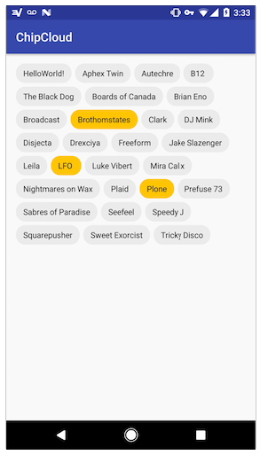

# ChipCloud 3
[](https://jitpack.io/#fiskurgit/ChipCloud) [](https://github.com/fiskurgit/ChipCloud/blob/master/LICENSE) [](https://www.codacy.com/app/fiskur/ChipCloud?utm_source=github.com&amp;utm_medium=referral&amp;utm_content=fiskurgit/ChipCloud&amp;utm_campaign=Badge_Grade) [](https://gitter.im/fiskurgit/fiskur)
<a href="http://www.methodscount.com/?lib=com.github.fiskurgit%3AChipCloud%3A2.1.0"></a>

ChipCloud 3 is a fresh rewrite of the original quickly hacked together library. The previous iteration was becoming popular as an easy replacement for a dropdown/spinner in e-commerce user interfaces, offering improved UX and more efficient use of screen real estate. The rewrite provides an improved API, a fraction of the code, and has no dependencies on other libraries. The biggest change is it's now not a View/Layout; it's a simple class that adds Chips to a supplied ViewGroup.


## Usage

Although ChipCloud can be used with any ViewGroup to get the wrapping 'Chip Cloud' that was the original focus of the library you should use [Google's FlexboxLayout](https://github.com/google/flexbox-layout) - see the demo project for a full example.

```java
//To create the same wrapping cloud as previous incarnation use Google's FlexboxLayout:
FlexboxLayout flexbox = (FlexboxLayout) findViewById(R.id.flexbox);

//Create a new ChipCloud with a Context and ViewGroup:
ChipCloud chipCloud = new ChipCloud(this, flexbox);

//Add a single Chip:
chipCloud.addChip("HelloWorld!");

//or pass a List or Array of any Object:
String[] demoArray = getResources().getStringArray(R.array.demo_array);
chipCloud.addChips(demoArray);
```

## Modes

### Multi  
```ChipCloud chipCloud = new ChipCloud(this, flexbox, ChipCloud.SelectMode.multi);```

The default mode; multiple chips can be selected.

### Single
```ChipCloud chipCloud = new ChipCloud(this, flexbox, ChipCloud.SelectMode.single);```

Only one chip can be selected at a time.

### Mandatory
```ChipCloud chipCloud = new ChipCloud(this, flexbox, ChipCloud.SelectMode.mandatory);```

Similar to a RadioGroup, only one chip can be selected, and once one has been chosen it's not possible to deselect it, you can click on another chip but one will always be checked.

### None
```ChipCloud chipCloud = new ChipCloud(this, flexbox, ChipCloud.SelectMode.none);```

No interaction, the chips just act as feedback for a user (eg. to display a list of tags associated with a news article).



## Dependency

Add jitpack.io to your root build.gradle, eg:

```groovy
allprojects {
    repositories {
        jcenter()
        maven { url "https://jitpack.io" }
    }
}
```

then add the dependency to your project build.gradle:

```groovy
dependencies {
    compile fileTree(dir: 'libs', include: ['*.jar'])
    compile 'com.github.fiskurgit:ChipCloud:3.0.1'
}
```
You can find the latest version in the releases tab above: https://github.com/fiskurgit/ChipCloud/releases

More options at jitpack.io: https://jitpack.io/#fiskurgit/ChipCloud

##Licence

Full licence here: https://github.com/fiskurgit/ChipCloud/blob/master/LICENSE

In short:

> The MIT License is a permissive license that is short and to the point. It lets people do anything they want with your code as long as they provide attribution back to you and don’t hold you liable.
